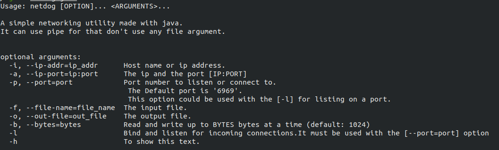

# NetDog

<h4>It's a simple command line network tool for regular usage.</h4> 

# Compiling packages
If you are not using a IDE then use this command to compile the packages. 
<code>
	$ git clone https://github.com/0x30c4/NetDog.git
</code>
 
<code>
	$ cd NetDog
</code>
 
<code>
	$ find src -name "\*.java" | xargs javac -d . # This won't work in windows, you need to do it manually.But in UNIX like system it will work fine. 
</code>
 
<code>
	$ javac NetDog.java
</code>

# Usage
After compiling to use it 
<code>
$ java NetDog --help
</code>

